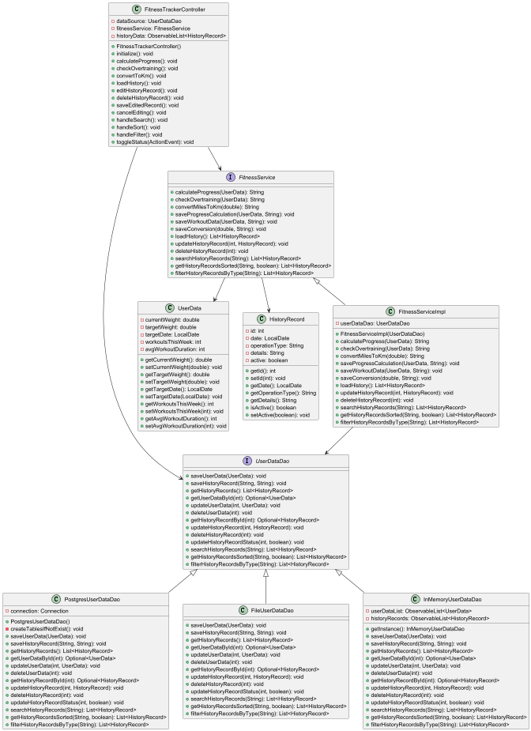

# Проект Fitness Tracker

## Описание

**Fitness Tracker** — это приложение для отслеживания фитнес-прогресса с поддержкой различных источников данных, разработанное на JavaFX. Оно позволяет пользователям анализировать прогресс в похудении, проверять уровень тренировочной нагрузки, конвертировать единицы измерения и вести историю операций. Приложение реализует паттерн **DAO (Data Access Object)** для работы с тремя типами хранилищ: оперативной памятью, файловой системой и PostgreSQL базой данных.

---

## Технологический стек

- **Основной язык программирования**: Java
- **Фреймворк**: JavaFX
- **Базы данных**: PostgreSQL
- **Тип программного обеспечения**: Отдельное приложение

---

## Статус

**Версия 1.0** — стабильная версия с базовым функционалом.

---

## Скриншот рабочего окна приложения


---

## Что отличает этот проект от похожих

- Реализация паттерна DAO для работы с разными источниками данных (память, файлы, БД)
- Комплексный анализ фитнес-данных:
    - Расчет безопасных темпов похудения
    - Проверка на перетренированность
    - Конвертация единиц измерения
- Полнофункциональная система истории операций с возможностью поиска, сортировки и фильтрации
- Интуитивно понятный интерфейс на JavaFX

---

## Архитектура

### Диаграмма классов


### Диаграмма пакетов


---

### Назначение пакетов

- **`model`**: Содержит классы моделей данных (UserData, HistoryRecord)
- **`dao`**: Содержит интерфейсы и реализации DAO для разных источников данных
- **`controller`**: Содержит класс управления приложением
- **`service`**: Реализует бизнес-логику приложения

---

## Зависимости

- **Java 11 или выше**
- **JavaFX SDK**
- **PostgreSQL JDBC Driver**

---

## Установка

1. **Клонируйте репозиторий**:
   ```bash
   git clone https://github.com/yourusername/fitness-tracker.git
   
## Установка

1. **Клонируйте репозиторий:**
   ```bash
   git clone https://github.com/yourusername/fitness-tracker.git

2. Настройте PostgreSQL:
    - Создайте базу данных ft_bd.

   Настройки подключения по умолчанию:
    - URL: jdbc:postgresql://localhost:7777/ft_bd
    - Логин/пароль: postgres/postgres

---

## Руководство по запуску и использованию

### Запуск приложения

1. Запустите класс Application.
2. Выберите источник данных (Память, Файл или PostgreSQL).

### Основные функции

- Расчет прогресса похудения:
    - Введите текущий и целевой вес.
    - Укажите срок достижения цели.
    - Получите рекомендации по безопасным темпам похудения.

- Анализ тренировочной нагрузки:
    - Введите количество тренировок и их среднюю продолжительность.
    - Получите оценку уровня нагрузки и рекомендации.

- Конвертация миль в километры:
    - Введите значение в милях.
    - Получите эквивалент в километрах.

- Работа с историей:
    - Просматривайте историю всех операций.
    - Используйте поиск, сортировку и фильтрацию.
    - Редактируйте или удаляйте записи.

---

## Проверка ПО

Приложение включает базовые тесты для проверки функциональности. Для запуска:
- В IDE: запустите тесты из пакета test.
- Для модульного тестирования рекомендуется использовать JUnit 5.

---

## Проблемы и известные ограничения

- При работе с PostgreSQL:
    - Нет автоматического переподключения при разрыве соединения.
    - Требуется предварительная настройка БД.

- При работе с файлами:
    - Формат файлов фиксированный.
    - Нет поддержки одновременного доступа из нескольких экземпляров приложения.

---

## Получение справочной информации

Если у вас возникли вопросы или проблемы:
- Проверьте Issues в репозитории проекта.
- Ошибки работы с БД выводятся в Alert-окнах.
- Логи работы выводятся в консоль.

---

## Приглашение к сотрудничеству

Мы приветствуем вклад в развитие проекта. Возможные направления для улучшений:
- Добавление новых типов анализа данных.
- Реализация экспорта/импорта данных.
- Улучшение интерфейса пользователя.
- Добавление системы учета питания.

### Для участия:
1. Создайте Issue с описанием предложения.
2. Сделайте Fork репозитория.
3. Создайте Pull Request с вашими изменениями.
